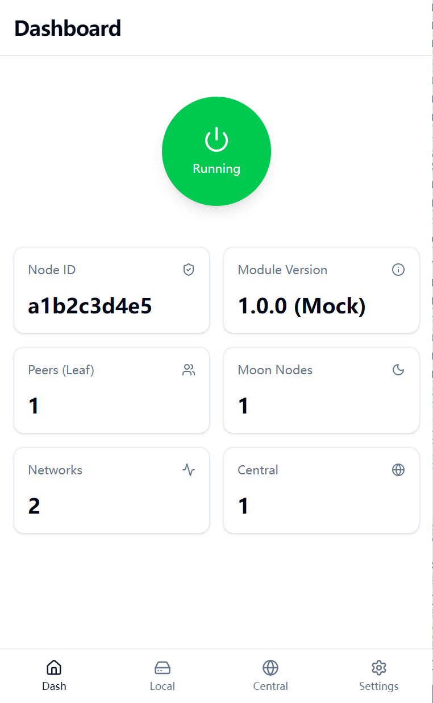
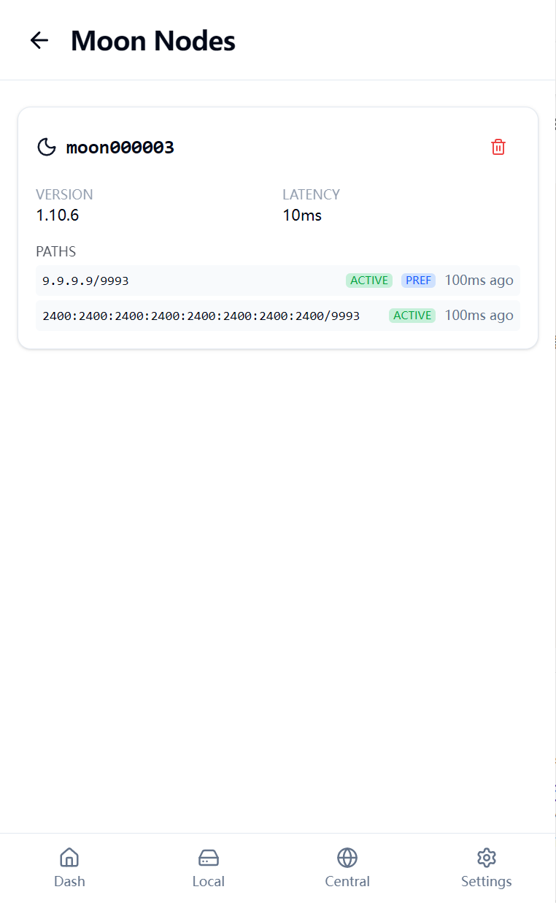
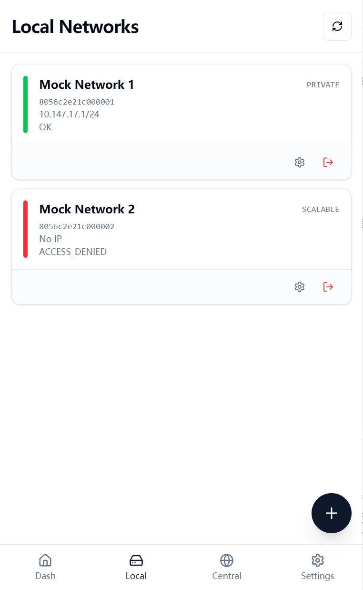
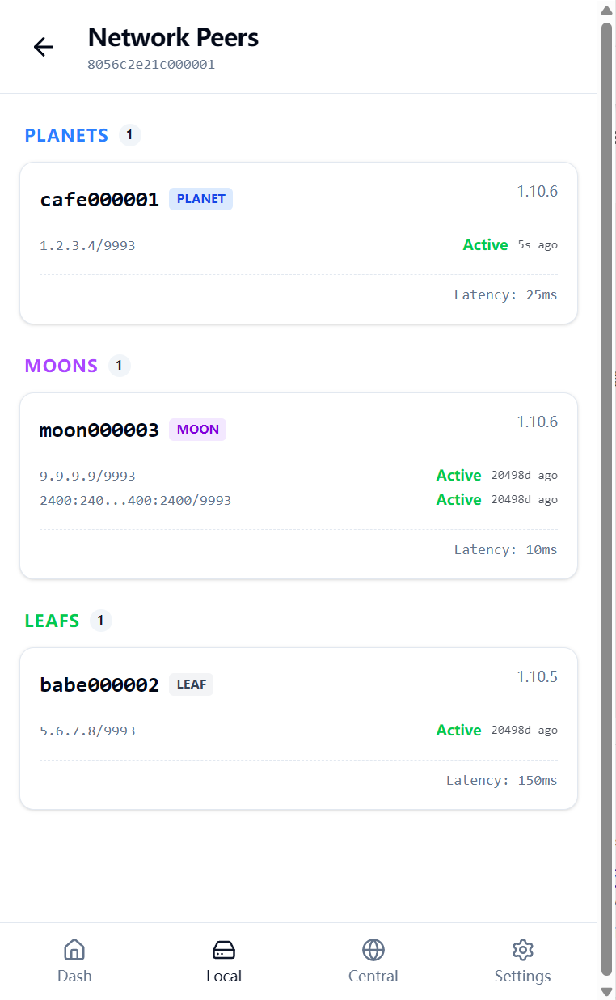
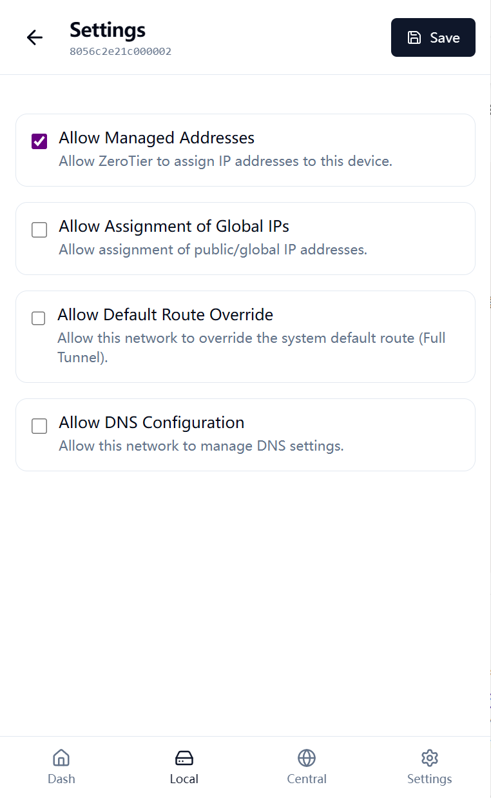
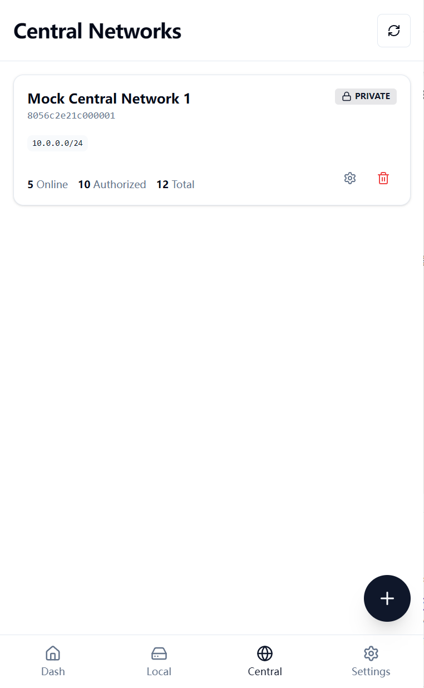
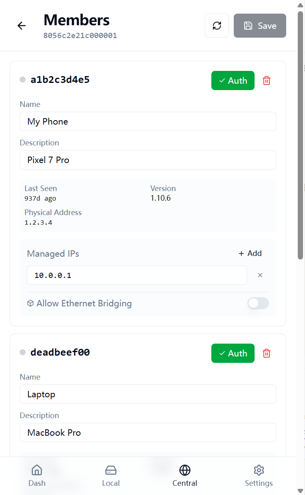
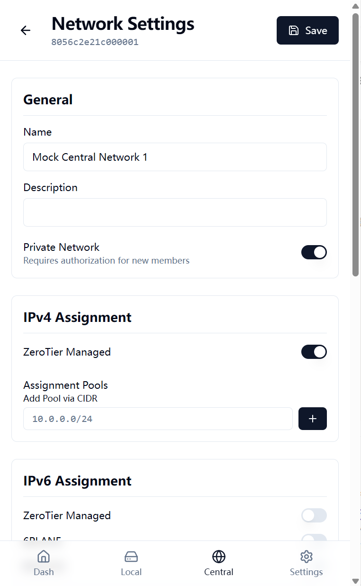
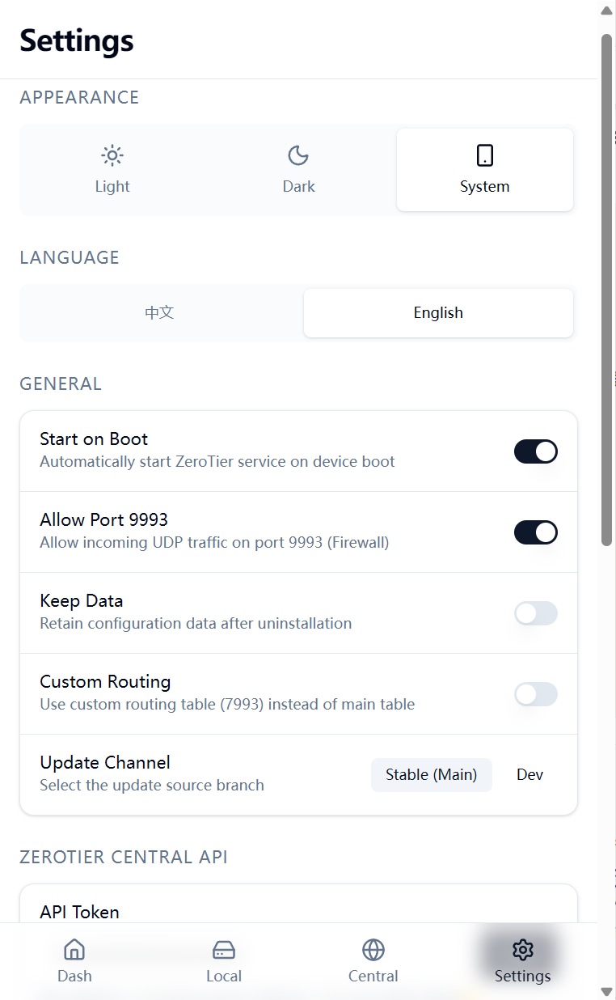

# ZeroTier for KSU

[](https://github.com/powerAn2020/ZeroTierForKSU/releases)
[](https://github.com/powerAn2020/ZeroTierForKSU/releases)

基于KSU WEBUI实现的Zertier客户端，同时支持部分zerotier服务端功能，需要自行准备[API Token](https://my.zerotier.com/account#tokens)。

Magisk需要搭配[5ec1cff/KsuWebUIStandalone](https://github.com/5ec1cff/KsuWebUIStandalone)使用。

自1.14.0之后KSU版本需要在`11928`以上才能正常使用UI


## 免责声明

本项目不对以下情况负责：设备变砖、SD 卡损坏或 SoC 烧毁。

## 模块截图

<table>
  <tr>
    <td></td>
    <td></td>
    <td></td>
  </tr>
  <tr>
    <td></td>
    <td></td>
    <td></td>
  </tr>
  <tr>
    <td></td>
    <td></td>
    <td></td>
  </tr>
</table>

## 一些可选操作说明

### 文件说明

#### Zerotier数据目录:`/data/adb/zerotier`；在该目录下创建以下文件可以做到

  创建文件`/data/adb/zerotier/KEEP_ON_UNINSTALL`，卸载模块可保留数据目录

  创建文件`/data/adb/zerotier/MANMANUAL`，关闭开机自启

  创建文件`/data/adb/zerotier/ALLOW_9993`，iptables放行UDP 9993入端口
  
  创建文件`/data/adb/zerotier/ROUTER_RULE_NEW`，zerotier流量路由模式改为新建路由规则表，删除该文件则是提升main表优先级模式

### 执行脚本说明

### **执行所有脚本都需要带全路径/Executing all scripts requires a full path**

```Shell
  sh /data/adb/modules/ZeroTierForKSU/zerotier-cli # 同官方
  sh /data/adb/modules/ZeroTierForKSU/zerotier-idtool # 同官方
  sh /data/adb/modules/ZeroTierForKSU/zerotier.inotify # 监听/data/adb/zerotier/state目录，用于启动服务。
```

#### ZeroTier for KSU - zerotier.sh
```Shell
Usage:
  zerotier.sh options

Options:
  -h                                         -- Show this message.
  start                                      -- Start Zerotier Service
  restart                                    -- Retart Zerotier Service
  stop                                       -- Stop Zerotier Service
  status                                     -- Show Node Status
  token                                      -- Show Local Service Token
  apiToken                                   -- Show Remote Service apiToken
  inotifyd                                   -- Start inotifyd Service

Example:
  sh zerotier.sh -h
  sh zerotier.sh start
  sh zerotier.sh restart
  sh zerotier.sh stop
  sh zerotier.sh status
  sh zerotier.sh token
  sh zerotier.sh apiToken
  sh zerotier.sh inotifyd

```
#### ZeroTier for KSU - api.sh
```shell 

Usage:
  api.sh <api_type> [options]

Options:
  -h                                            -- Show this message.
  <api_type>   local/central
    local
      status                                    -- Show Node Status
      service                                    -- Manage Zerotier-One Service Status
        action     value:[ start | stop ]
      network                                   -- When the action is "list", "networkid" and "bodydata" are optional. When the action is "leave", "bodydata" is optional. When the action is "join", "networkid" and "bodydata" are required.
        action     value:[ list | leave | join ]
        networkid  value:[ networkid ](optional)
        bodydata   value:[ JSON object ](optional)
      peer                                      -- All the nodes your node knows about
      firewall                                  -- Control the firewall to allow traffic into port 9993
        action     value:[ A | D ]
      router                                    -- Set the Zerotier traffic routing method
        router     value:[ routing  | main ]
        action     value:[ A | D ]
      orbit                                     -- Join Private Root Servers
        moonid     value:[ moonid ]
    central
      status                                    -- Show Center Status
      network                                   -- When the action is "list", "networkid" and "bodydata" are optional. When the action is "remove", "bodydata" is optional. When the action is "add", No parameters are required. When the action is "modify", "networkid" and "bodydata" are required.
        action     value:[ list | remove | add | modify ]
        networkid  value:[ networkid ](optional)
        bodydata   value:[ JSON object ](optional)
      member                                    -- When the action is "list", "bodydata" and "memberID" are optional. When the action is "remove", "bodydata" is optional. When the action is "modify", "networkid", "memberID" and "bodydata" are required.
        action     value:[ list | remove | modify ]
        networkid  value:[ networkid ] (optional)
        memberID   value:[ memberID ] (optional)
        bodydata   value:[ JSON object ] (optional)
    apiToken                                    -- Manage the tokenAuth for accessing the central API
      action       value:[ show | update ]
      key          value:[ apiToken ]

Example:
  help
    sh api.sh -h

  local
    sh api.sh local status
    sh api.sh local service start
    sh api.sh local service stop
    sh api.sh local peer
    sh api.sh local firewall A
    sh api.sh local firewall D
    sh api.sh local router routing A 
    sh api.sh local router routing D 
    sh api.sh local router main A
    sh api.sh local router main D
    sh api.sh local orbit yourMoonid
    sh api.sh local network list
    sh api.sh local network leave yourNetworkid (suggest: use command `zerotier-cli leave yourNetworkid`)
    sh api.sh local network join  yourNetworkid {} (suggest: use command `zerotier-cli join yourNetworkid`)

  central
    sh api.sh central status
    sh api.sh central network list
    sh api.sh central network remove yourNetworkid
    sh api.sh central network add
    sh api.sh central network modify yourNetworkid {}
    sh api.sh central member list yourNetworkid
    sh api.sh central member remove yourNetworkid memberID
    sh api.sh central member modify yourNetworkid memberID '{"hidden":false,"config":{"authorized":true}}'

  apiToken
    sh api.sh apiToken show
    sh api.sh apiToken update xxxxxxxxx
```

## 感谢以下连接提供的帮助，顺序不分先后

- [是否有可能 Zerotier-One 直接在 Android 设备上运行? - V2EX](https://v2ex.com/t/863131)
- [Android以太网和WIFI完美共存](https://blog.csdn.net/G_Rookie/article/details/109679262)
- [Network Management in Android: Routing](https://yotam.net/posts/network-management-in-android-routing/)
- [vant-ui/vant-demo](https://github.com/vant-ui/vant-demo/tree/master/vant/vite)
- [zfdx123/build-k40-ksu](https://github.com/zfdx123/build-k40-ksu)
- [eventlOwOp/zerotier-magisk](https://github.com/eventlOwOp/zerotier-magisk/tree/master/zerotier)
- [linuxscreen/ZeroTierOneForMagisk](https://github.com/linuxscreen/ZeroTierOneForMagisk)
- [taamarin/box_for_magisk](https://github.com/taamarin/box_for_magisk/blob/master/box/scripts/box.inotify)
- [stunnel/static-curl](https://github.com/stunnel/static-curl)
- [tiann/KernelSU](https://github.com/tiann/KernelSU)
- [shell脚本如何优雅的打印帮助信息](https://blog.csdn.net/lhl_blog/article/details/107409694)
